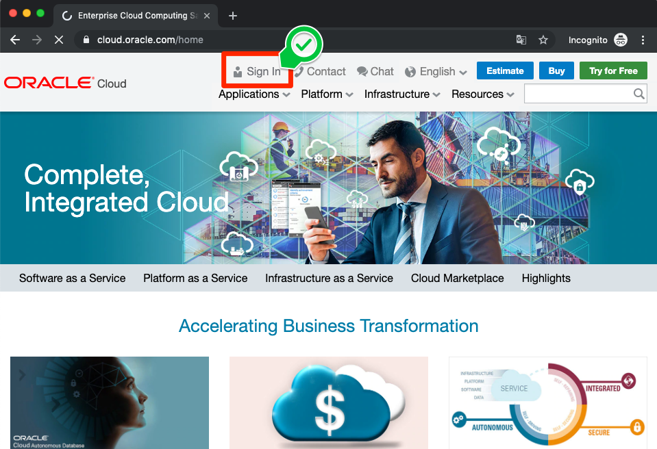
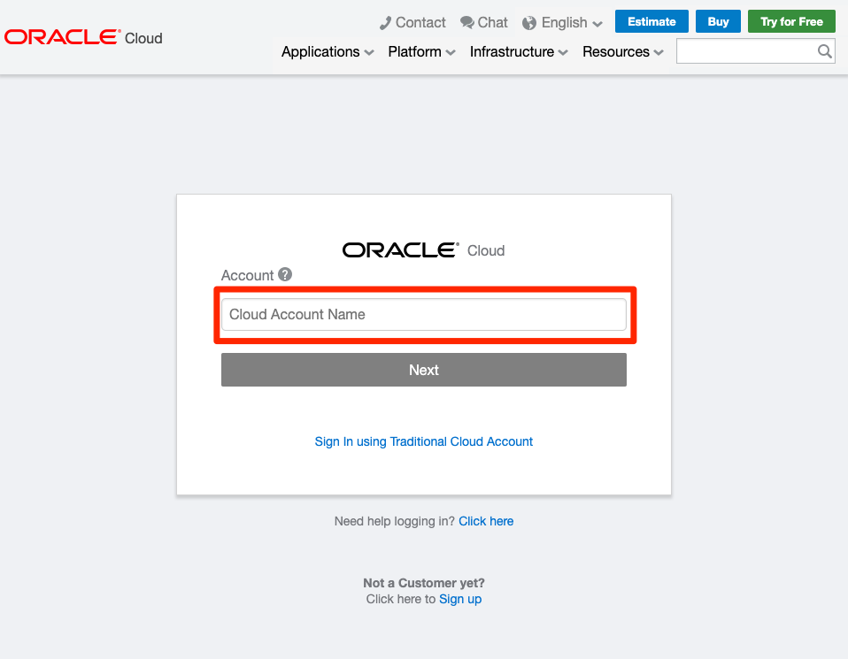
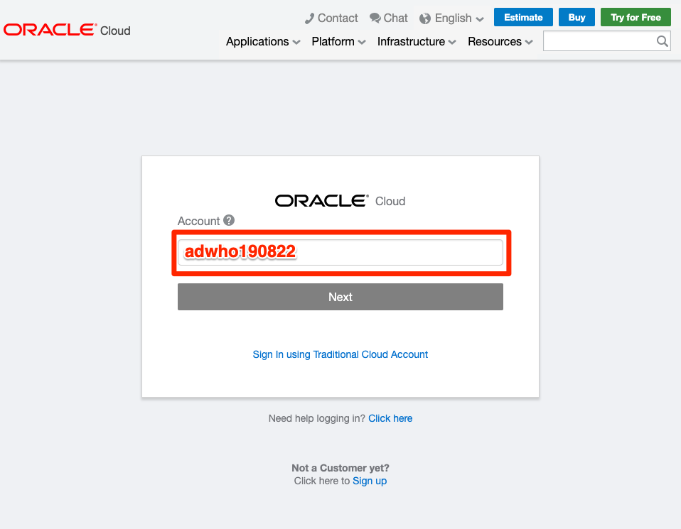
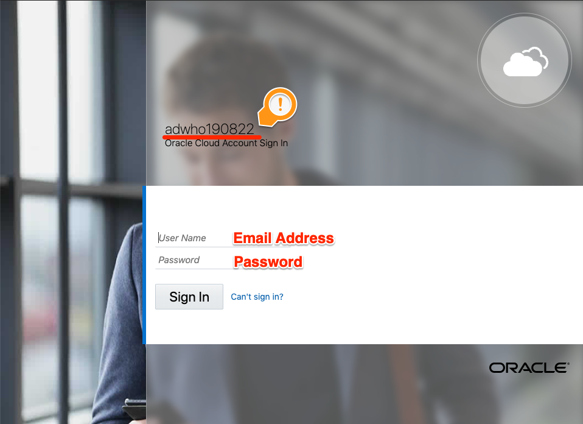

# 01 Begin : 오라클 클라우드 시작하기

## 실습 소개

이번 실습은 오라클 클라우드를 시작하기 위해 콘솔 대시보드를 접속하고 살펴봅니다.

## 실습 목표

- Oracle Cloud Console 접속 및 기능 살펴보기
- 오라클 클라우드 어카운트 이해하기
  - 오라클 클라우드의 IaaS, PaaS 등 솔루션을 생성하고, 운영하는 공간을 의미합니다.

## 사전 준비 사항

- 웹 브라우저
  - Microsoft Internet Explorer 11+
  - Google Chrome 63+
  - Mozilla Firefox 52+
  - Apple Safari 10+
- 오라클 클라우드 어카운트 (Oracle Cloud Account)
  - 오라클 클라우드 어카운트는 본 세션에 신청하신 이메일로 안내 메일이 전송 되었습니다.
    - **Welcome to ~~** 라는 제목으로 no-reply@oracle.com에서 안내 메일이 발송되었습니다.

## 따라하기

- 브라우저에서 **[cloud.oracle.com](https://cloud.oracle.com)**로 이동하여 `Sign In`  아이콘을 클릭합니다.
  
  
  

- `Cloud Account Name `을 입력하고, `Next` 클릭합니다.
  

  

- 계정 정보를 입력 후,    `Sign In` 클릭합니다.

  

- Hello World! 오라클 클라우드에 오신 것을 환영합니다!

  

[첫 페이지로 돌아가기](./README.md)

[다음 핸즈온으로 넘어가기](./02-create-adw.md)