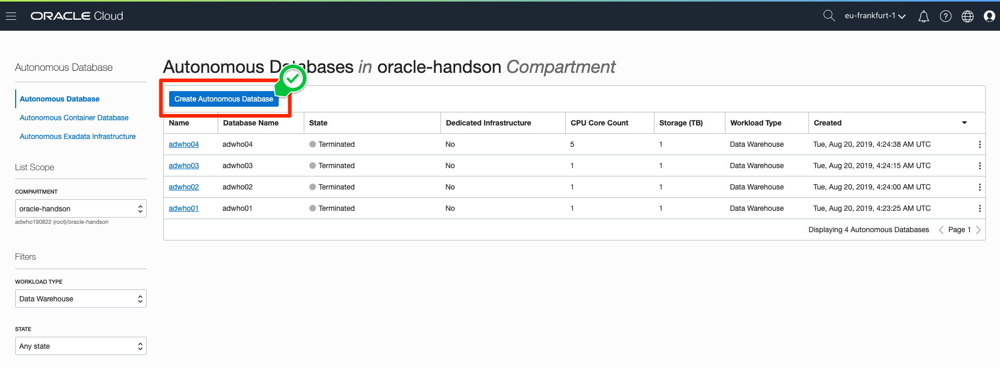
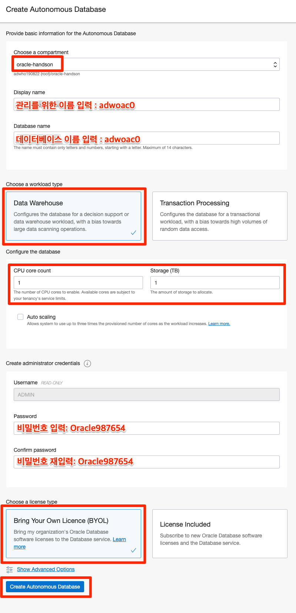
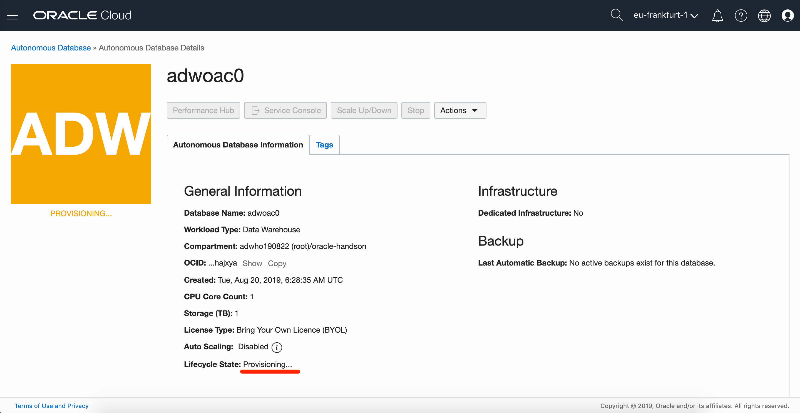
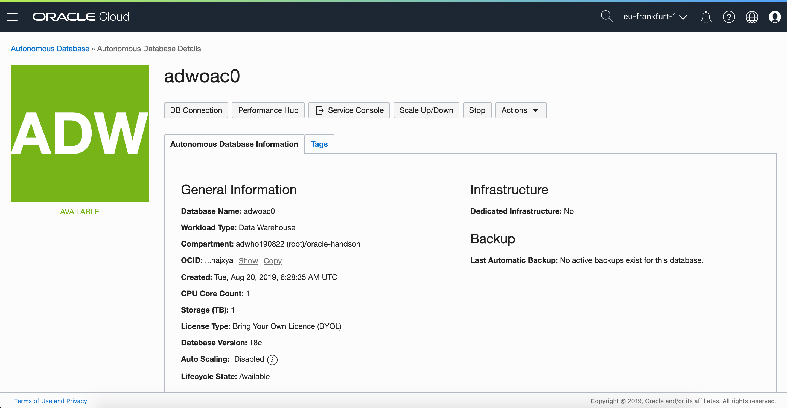

# 02 Create ADW : 자율 운영 데이터 웨어하우스 만들기

## 실습 소개

이번 실습은 오라클의 야심작! 자율 운영 데이터 웨어하우스, Autonomous Data Warehouse를 만들어 보겠습니다.
얼마나 쉽게 만들어지는지 알아볼까요?

## 실습 목표

- **Oracle Autonomous Data Warehouse** 만들기

- **Compartment** 이해하기
  
  - Oracle Cloud Account에서 구성하는 서비스들을 목적이나 조직으로 별도로 관리할 수 있도록 도와주는 기능입니다.
  
- **Oracle Autonomous Database** 이해하기

  자율 운영으로 운영되는 데이터베이스에는 특화된 목적에 따라 **두 가지 서비스**가 있습니다.

  - **Autonomous Data Warehouse** : 데이터 웨어하우싱에 특화된 자율적으로 운영되는 데이터 웨어하우스입니다.
  - **Autonomous Transaction Processing** : 트랜잭션 처리에 특화하여 자율적으로 운영되는 서비스입니다.

## 사전 준비 사항

- ~~데이터베이스 지식~~

# Steps

**Note:** 본 가이드에서 제시하는 화면과 실습하시는 분의 계정 상세정보가 다를 수 있습니다. (예: Compartment Name) 

### **STEP 1:  Oracle Cloud Dashboard**

- 오라클 클라우드 대시보드 화면에서 시작합니다.
  

  

- 좌측 상단의 `햄버거 메뉴 `를 선택하고, `Autonomous Data Warehouse`를 클릭합니다.
  

  

- 화면을 살펴봅니다. 좌측에  `Compartment`에서 `oracle-handson`을 클릭합니다.

  

  

  

- `Compartment`가 변경된 것을 확인합니다.

  

- `Create Autonomous Database` 을 선택합니다.

  

- 입력 폼에 원하는 값을 입력 후, `Create Autonomous Database`를 선택합니다.

  - `Choose a compartment` : oracle-handson
  - `Display name` : adwoac1~n
  - `Database name` : adwoac1~n
  - `Choose a workload type`
    - **Data Warehouse** 선택
      - 자율 운영되는 데이터 웨어하우스를 만듭니다!
    - Transaction Processing
      - 자율 운영되는 트랜잭션 처리용 데이터베이스를 생성할 때 사용합니다.
  - Configure the database
    - `CPU core count` : 1
    - `Storage(TB)` : 1
    - `Auto scailing` : Non Check
  - Create administrator credentials
    - `Username` : ADMIN
    - `Password` : Oracle987654
    - `Confirm password` : Oracle987654
  - `Choose a license type`
    - **Bring Your Own License (BYOL) 선택**
      - 이미 구매한 라이선스를 사용할 수 있습니다.
    - License included
      - 라이선스가 없어도 사용할 수 있습니다. 사용한 만큼 비용을 포함해서 지불합니다.

  

- 생성 중인 모습을 확인할 수 있습니다. 노란색으로 `PROVISIONING`  상태는 자동으로 구성 중입니다.

  

- 축하합니다! Autonomous Data Warehouse가 구성되었습니다.
  생성 완료 후, 기동 중인 모습을 확인할 수 있습니다. 초록색으로 `AVAILABLE`  상태는 자율 운영 중인 상태를 의미합니다.

  

