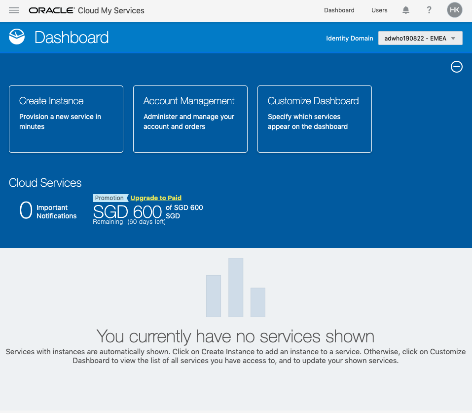
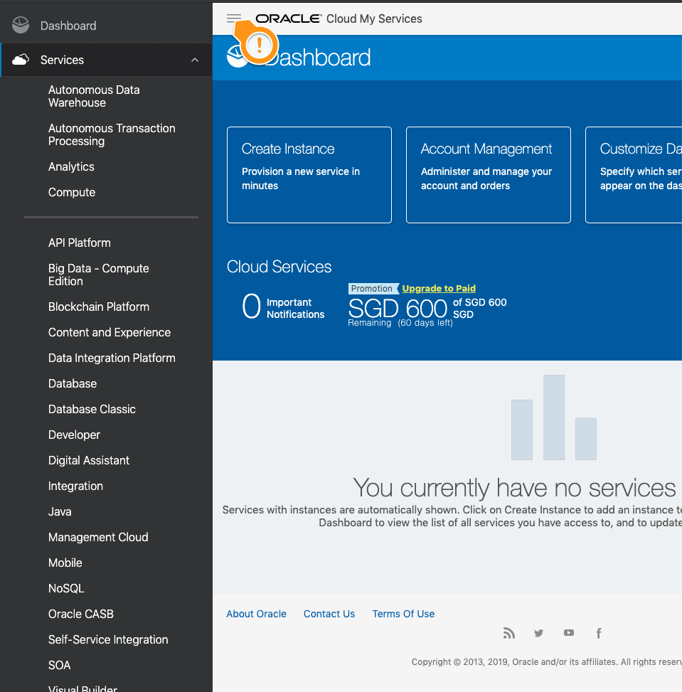
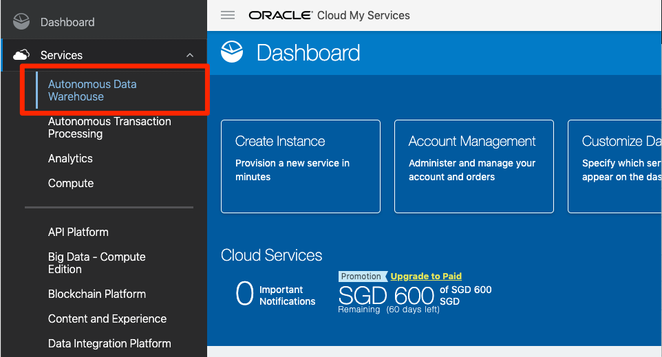
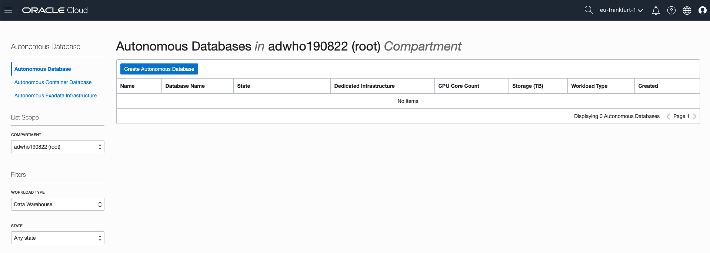
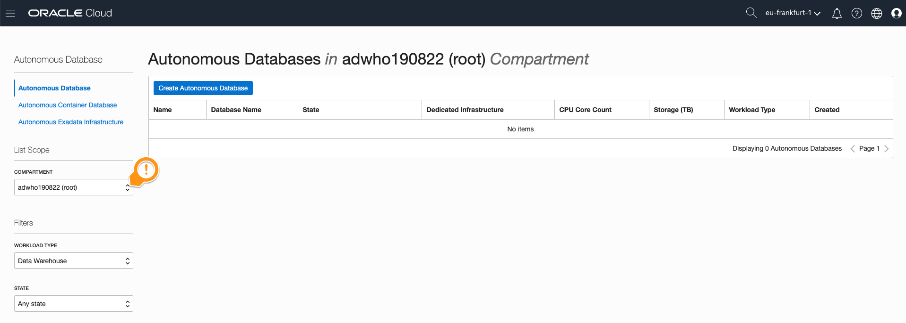
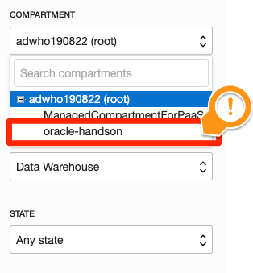
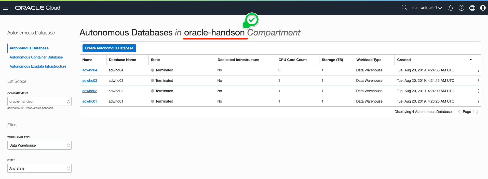

# 02 - Create ADW : 자율 운영 데이터 웨어하우스 만들기

## 실습 소개

이번 실습은 오라클의 야심작! 자율 운영 데이터 웨어하우스, Autonomous Data Warehouse를 만들어 보겠습니다.
얼마나 쉽게 만들어지는지 알아볼까요?

## 실습 목표

- Oracle Autonomous Data Warehouse 만들기
- Compartment 이해하기
  - Oracle Cloud Account에서 구성하는 서비스들을 목적이나 조직으로 별도로 관리할 수 있도록 도와주는 기능입니다.

## 사전 준비 사항

- ~~깊은 데이터베이스 전문 지식~~

# Steps

**Note:** 본 가이드에서 제시하는 화면과 실습하시는 분의 계정 상세정보가 다를 수 있습니다. (예: Compartment Name) 

### **STEP 1:  Oracle Cloud Dashboard**

- 오라클 클라우드 대시보드 화면에서 시작합니다.
  

  

- 좌측 상단의 `햄버거 메뉴 `를 선택하고, `Autonomous Data Warehouse`를 클릭합니다.
  

  

- 화면을 살펴봅니다. 좌측에  `Compartment`에서 `oracle-handson`을 클릭합니다.

  

  

  

- Hello World! 오라클 클라우드에 오신 것을 환영합니다!

  

