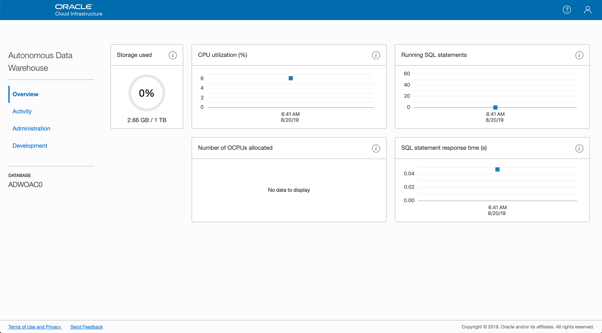
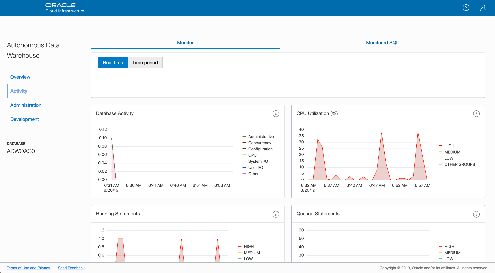
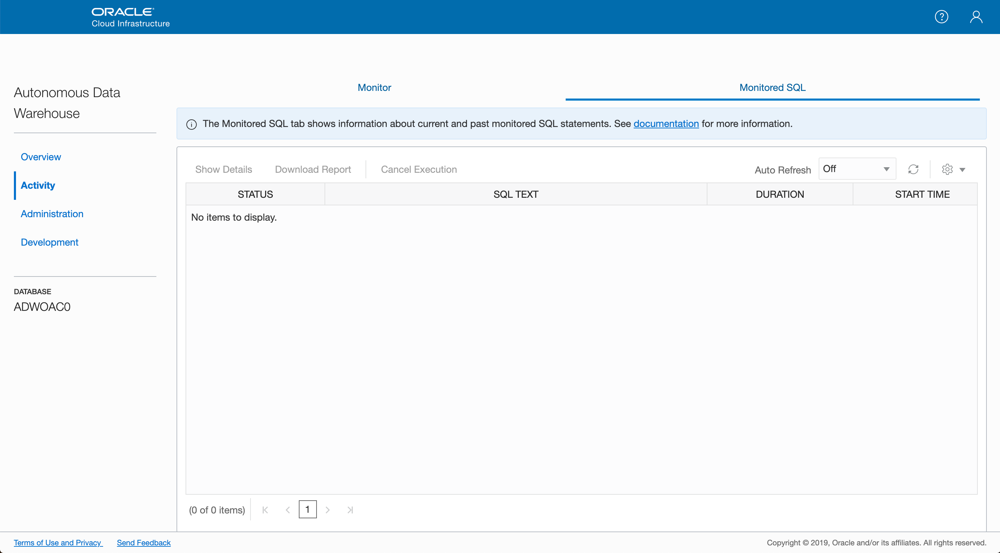
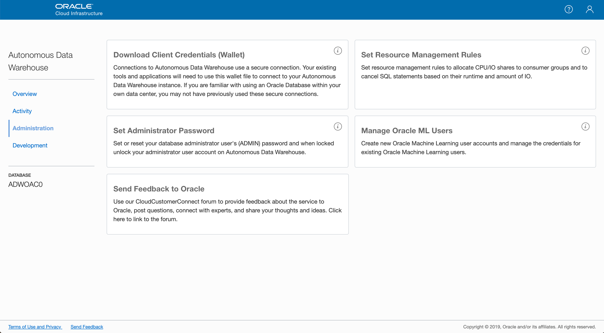
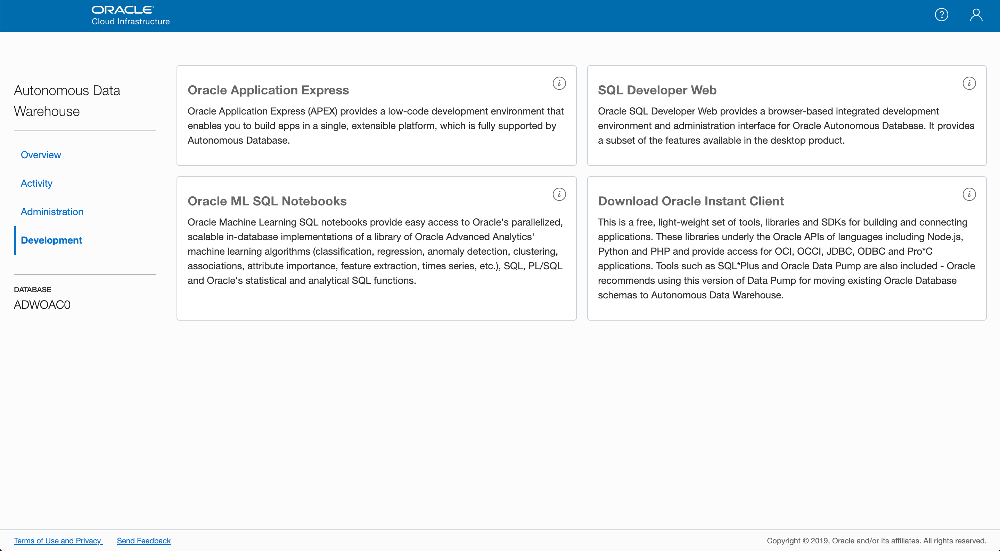

# 03 Monitoring ADW : 자율 운영 데이터 웨어하우스가 일을 잘하고 있는지 살펴볼까요?

## 실습 소개

앞서 만들어 본 자율 운영 데이터 웨어하우스, 운영이 잘되고 있는지 간단하게 살펴볼까요?

데이터 웨어하우스하면 크고 복잡하고 관리가 힘들다고 생각하지 않으신가요? 머리가 지끈거리기 시작하지 않나요?

Don't worry! Be Happy! 걱정 하지 마세요. 오라클 자율 운영 데이터 웨어하우스는 어렵지 않아요.

## 실습 목표

- 자율 운영 데이터 웨어하우스를 모니터링 하는 방법을 이해하기

## 사전 준비 사항

- 자율 운영 데이터 웨어하우스 (Oracle Autonomous Data Warehouse)
- ~~데이터베이스 지식~~
- 웹 브라우저
  - Microsoft Internet Explorer 11+
  - Google Chrome 63+
  - Mozilla Firefox 52+
  - Apple Safari 10+
- 오라클 클라우드 어카운트 (Oracle Cloud Account)

## 따라하기

- 생성한 Autonomous Data Warehouse 정보 화면에서 `Service Console 을 클릭합니다.
  

- **Overview** 입니다.
  
  실시간으로 서비스 이용에 관한 정보를 확인할 수 있습니다.
  
  - **Storage used**: 총 스토리지 용량과 사용된 스토리지 용량을 보여줍니다. 현재 사용중인 공간의 백분율을 나타냅니다. 사용된 스토리지 용량은 모든 테이블 스페이스에 할당된 총 공간입니다.
  - **CPU utilization**: 이 차트는 서비스의 과거 CPU 사용률을 보여줍니다.
    - Auto Scaling Disabled :시간별 데이터를 보여줍니다. 데이터 포인트는 해당 시간의 평균 CPU 사용률을 보여줍니다. 예를 들어 10:00의 데이터 포인트는 9 : 00-10 : 00의 평균 CPU 사용률을 나타냅니다.
      사용률은 데이터베이스에서 사용할 수있는 CPU 수 (OCPU 수의 두 배)에 대해보고됩니다. 예를 들어, 데이터베이스에 4 개의 OCPU가있는 경우이 그래프의 백분율은 8 개의 CPU를 기준으로합니다.
    - Auto Scaling Enabled: 사용 가능한 백분율은 데이터베이스에서 사용할 수있는 최대 CPU 수 (OCPU 수의 6 배)에 대해보고됩니다. 예를 들어, 데이터베이스에 자동 스케일링이 활성화 된 4 개의 OCPU가있는 경우이 그래프의 백분율은 24 개의 CPU를 기준으로합니다.
  - **Running SQL statements**: 실행 중인 평균 쿼리 질의 수를 보여줍니다. 시간별 데이터를 보여줍니다. 데이터 포인트는 해당 시간 동안 실행중인 SQL 문을 보여줍니다. 예를 들어, 10:00의 데이터 포인트는 9 : 00-10 : 00에 대한 평균 실행 SQL 문 수를 나타냅니다.
  - **Number of OCPUs allocated**: 이 차트는 할당 된 OCPU 수를 보여줍니다.
    - **Auto Scaling Disabled** : 자동 스케일링이 비활성화 된 데이터베이스의 경우, 데이터베이스가 적어도 일부 시간 동안 열려있는 경우 차트에 데이터베이스에 할당 된 OCPU 수가 표시됩니다.
    - **Auto Scaling Enabled** : **Auto Scaling이 활성화 된** 데이터베이스의 경우 시간당 해당 값이 프로비저닝 된 OCPU 수보다 높은 경우 해당 시간 동안 사용 된 평균 OCPU 수를 차트에 표시합니다. 사용 된 OCPU 수가 프로비저닝 된 OCPU 수보다 크지 않으면 차트에 해당 시간에 할당 된 OCPU 수가 표시됩니다.
    - **중지 된 데이터베이스** : 데이터베이스가 전체 시간 동안 중지 된 경우 차트에는 해당 시간에 할당 된 OCPU가 0으로 표시됩니다.
  - **SQL statement response time (s)** : 이 차트는 역사적으로 SQL 문의 평균 응답 시간 (초)을 보여줍니다. 이 차트는 시간별 데이터를 보여줍니다. 데이터 포인트는 해당 시간의 평균 SQL 문 응답 시간을 보여줍니다. 예를 들어, 10:00의 데이터 포인트는 9 : 00-10 : 00 사이의 시간에 대한 평균 SQL 문 응답 시간 (초)을 표시합니다.

성능 데이터의 기본 보존 기간은 8 일입니다. 따라서 CPU 사용률, 실행 명령문 및 평균 SQL 응답 시간 차트에는 기본적으로 지난 8 일 동안의 데이터가 표시됩니다.

- **Activity > Monitor** 입니다.

  서비스의 성능에 대한 내용을 알 수 있습니다.
  
  **Real time**은 실시간으로 조회되며, 조회 시점 기준으로 지난 60분 동안의 성능 데이터를 나타냅니다.
  
  **Time period**는 이전 데이터를 볼 수 있습니다. Default 보존 기간은 8일 입니다.
  
  - **Database Activity**
  
    이 차트는 CPU를 사용하거나 대기 이벤트를 기다리는 데이터베이스의 평균 세션 수를 보여줍니다. 대기 이벤트에 대한 자세한 내용 은 [Oracle Database Reference](https://www.oracle.com/pls/topic/lookup?ctx=en/cloud/paas/autonomous-data-warehouse-cloud/user&id=REFRN-GUID-B30B0811-0FDC-40FC-92FC-F6726CE94736)를 참조하십시오.
  
  - **CPU Utilization**
  
    이 차트는 각 소비자 그룹의 CPU 사용률을 보여줍니다. 사용률은 데이터베이스에서 사용할 수있는 CPU 수 (OCPU 수의 두 배)에 대해보고됩니다. 예를 들어, 데이터베이스에 4 개의 OCPU가있는 경우이 그래프의 백분율은 8 개의 CPU를 기준으로합니다.
  
    자동 스케일링이 사용 가능한 데이터베이스의 경우, 사용 가능한 백분율은 데이터베이스에서 사용할 수있는 최대 CPU 수 (OCPU 수의 6 배)에 대해보고됩니다. 예를 들어, 데이터베이스에 자동 스케일링이 활성화 된 4 개의 OCPU가있는 경우이 그래프의 백분율은 24 개의 CPU를 기준으로합니다.
  
    소비자 그룹에 대한 자세한 정보는 [자율 데이터웨어 하우스의 동시성 및 우선 순위 관리를](https://docs.oracle.com/en/cloud/paas/autonomous-data-warehouse-cloud/user/manage-priorities.html#GUID-80E464A7-8ED4-45BB-A7D6-E201DD4107B7) 참조 해주세요.
  
  - **Running Statements**
  
    이 차트는 각 이용자 그룹에서 실행중인 평균 SQL 문 수를 보여줍니다. 소비자 그룹에 대한 자세한 정보는 [자율 데이터웨어 하우스의 동시성 및 우선 순위 관리를](https://docs.oracle.com/en/cloud/paas/autonomous-data-warehouse-cloud/user/manage-priorities.html#GUID-80E464A7-8ED4-45BB-A7D6-E201DD4107B7) 참조 해주세요.
  
  - **Queued Statements**
  
    이 차트는 각 이용자 그룹의 평균 대기 SQL 문 수를 보여줍니다. 소비자 그룹에 대한 자세한 정보는 [자율 데이터웨어 하우스의 동시성 및 우선 순위 관리를](https://docs.oracle.com/en/cloud/paas/autonomous-data-warehouse-cloud/user/manage-priorities.html#GUID-80E464A7-8ED4-45BB-A7D6-E201DD4107B7) 참조 해주세요.
  
  
  
  
  
- **Time period**를 선택하여 조회 하고자 하는 기간을 선택할 수 있습니다.

  

  

- **Activity > Monitored SQL** 입니다.

  현재와 과거에 질의된 SQL 정보를 보여줍니다.
  
  참조 [데이터베이스 작업을 모니터링 정보](https://www.oracle.com/pls/topic/lookup?ctx=en/cloud/paas/autonomous-data-warehouse-cloud/user&id=TGSQL790) 의 *데이터베이스 SQL 튜닝 가이드* .
  
  
  
  
  
  

- **Administration** 화면입니다.

  - Manage Oracle ML Users : Oracle Machine Learning 노트북을 사용하기 위한 계정을 생성하고 관리할 수 있습니다.
  
  

- **Development** 화면입니다.

  - SQL Developer Web : SQL Developer를 웹으로 설치 없이 사용할 수 있습니다.
  - Oracle ML SQL Notebooks : Oracle Machine Learning을 사용할 수 있는 웹 개발 환경입니다. Apache Zeppelin Notebook 기반입니다.
  
  

[첫 페이지로 돌아가기](./README.md)

[이전 핸즈온으로 돌아가기](02-create-adw.md)

[다음 핸즈온으로 넘어가기](04-query-adw.md)