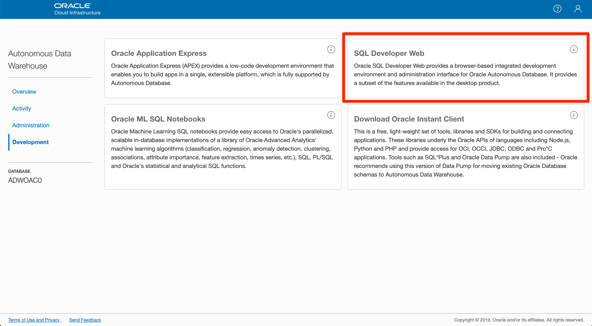
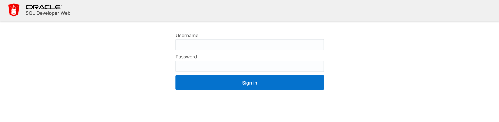
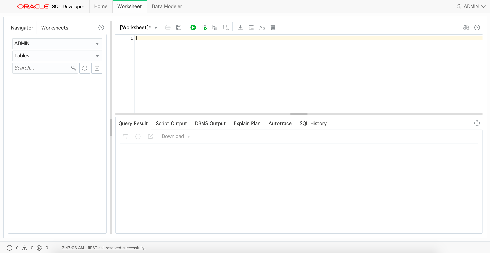
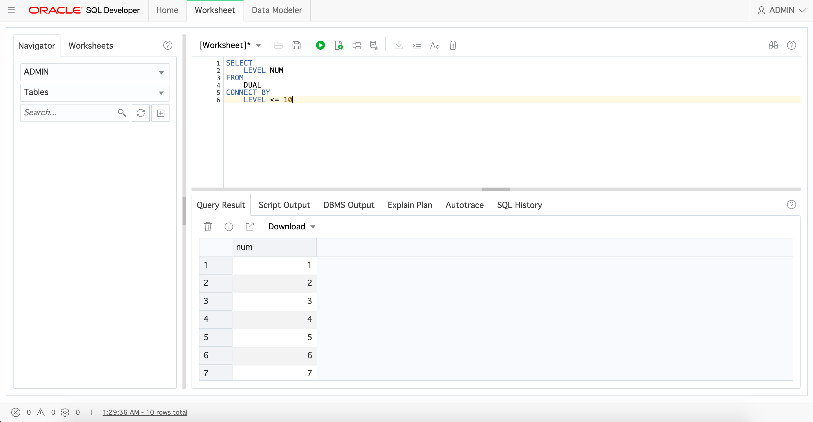

# 04 Query to ADW : 자율 운영 데이터 웨어하우스에 쿼리 날려 보기

## 실습 소개

본 실습은 자율 운영 데이터 웨어하우스에 쿼리를 실행하여 데이터를 살펴 보는 방법을 알아봅니다.

기존 On-Premise에서 사용하던 오라클 데이터베이스는 SQL Developer 같은 툴이 필요 했어요. **하지만** 오라클 클라우드에서 관리되는 자율 운영 데이터 웨어하우스는 별도의 설치 없이! **웹 형태**로 사용할 수 있는 **SQL Developer Web**가 있어요!
거기다 기존의 방법과 동일하게 로컬 PC에 설치된 SQL Developer에서도 사용할 수 있답니다.

## 실습 목표

- Oracle Autonomous Data Warehouse의 데이터를 Query 통해 살펴보기

## 사전 준비 사항

- 자율 운영 데이터 웨어하우스 (Oracle Autonomous Data Warehouse)
- ~~데이터베이스 지식~~
  - 아주 아주 간단한 Query Syntax (SELECT / FROM만 알아도 괜찮아요)
- 웹 브라우저
  - Microsoft Internet Explorer 11+
  - Google Chrome 63+
  - Mozilla Firefox 52+
  - Apple Safari 10+
- 오라클 클라우드 어카운트 (Oracle Cloud Account)

## 따라하기

- Autonomous Data Warehouse Console에서 `Development > SQL Developer Web` 을 선택합니다.
  


- `Username `과  `Password `를 입력하고, `Sign in`을 선택합니다.
  
- Username :
  - Password :
  
  


- SQL Developer Web 환경입니다.

  
  
  
  
- 어디 쿼리를 날려볼까요? 아래의 SQL 쿼리를 입력해서 실행해봅니다.

  ```sql
  SELECT
      LEVEL NUM
  FROM
      DUAL
  CONNECT BY
      LEVEL <= 10
  ```
  
  


[첫 페이지로 돌아가기](./README.md)

[이전 핸즈온으로 돌아가기](03-monitoring-adw.md)

[다음 핸즈온으로 넘어가기](05-analytics.md)