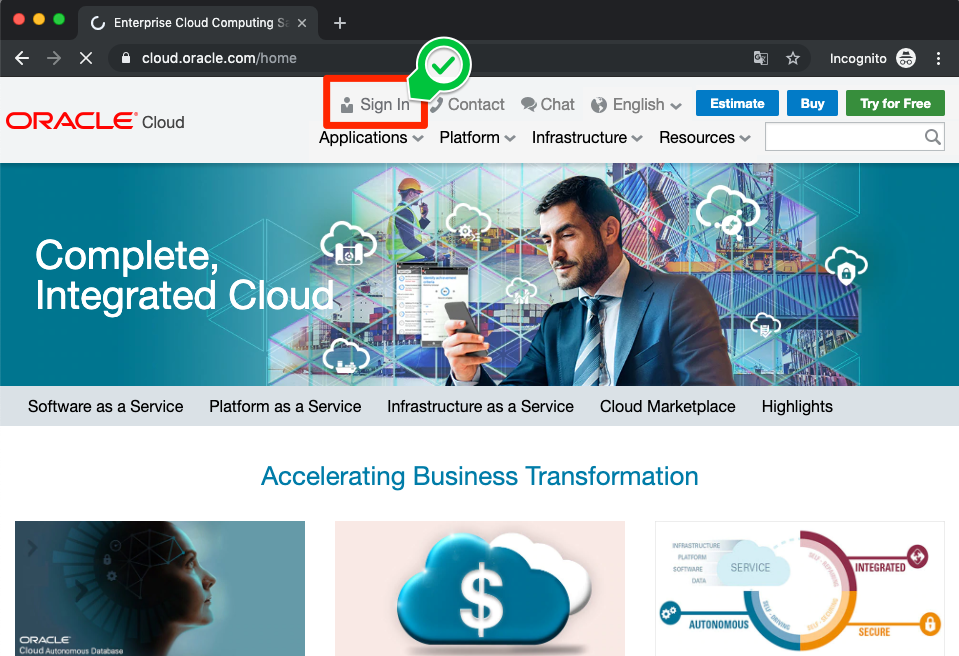

# 04 Query at ADW : 자율 운영 데이터 웨어하우스에 쿼리 날려 보기

## 실습 소개

본 실습은 자율 운영 데이터 웨어하우스에 쿼리를 실행하여 데이터를 살펴 보는 방법을 알아봅니다.

기존 On-Premise에서 사용하던 오라클 데이터베이스는 SQL Developer 같은 툴이 필요 했어요. 하지만 오라클 클라우드에서 관리되는 자율 운영 데이터 웨어하우스는 웹 형태로 쿼리를 실행 할 수 있는 Web SQL Developer가 있어요!
거기다 기존의 방법과 동일하게 로컬 PC에 설치된 SQL Developer에서도 사용할 수 있답니다.

## 실습 목표

- Oracle Autonomous Data Warehouse에 Query 실행하기

## 사전 준비 사항

- 자율 운영 데이터 웨어하우스 (Oracle Autonomous Data Warehouse)
- ~~데이터베이스 지식~~
- 웹 브라우저
  - Microsoft Internet Explorer 11+
  - Google Chrome 63+
  - Mozilla Firefox 52+
  - Apple Safari 10+
- 오라클 클라우드 어카운트 (Oracle Cloud Account)

# Steps

**Note:** 본 가이드에서 제시하는 화면과 실습하시는 분의 계정 상세정보가 다를 수 있습니다. (예: Compartment Name) 

### **STEP 1:  Oracle Cloud 접속**

- 브라우저에서 **[cloud.oracle.com](https://cloud.oracle.com)**로 이동하여 `Sign In`  아이콘을 클릭합니다.
  

  

- `Cloud Account Name `을 입력하고, `Next` 클릭합니다.
  

  

- 계정 정보를 입력 후,    `Sign In` 클릭합니다.

  

- Hello World! 오라클 클라우드에 오신 것을 환영합니다!

  

[첫 페이지로 돌아가기](./README.md)

[이전 핸즈온으로 돌아가기](03-monitoring-adw.md)

[다음 핸즈온으로 넘어가기](05-analytics.md)