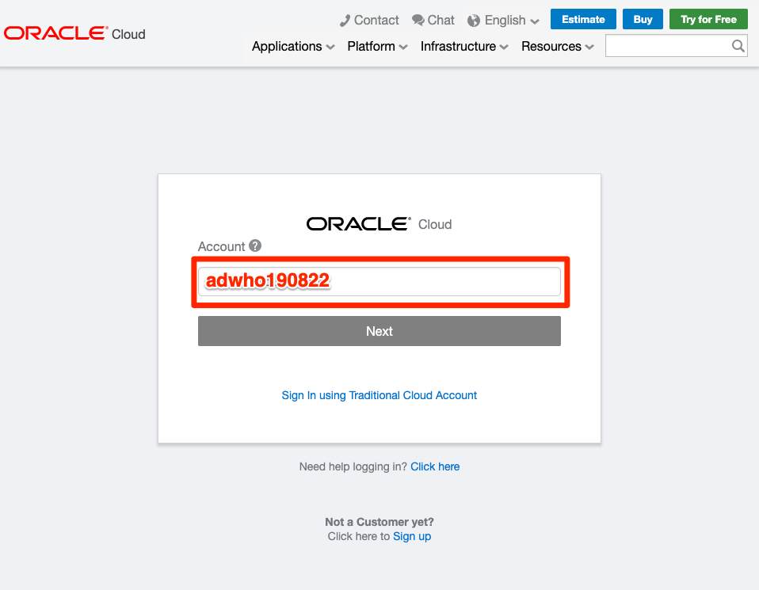
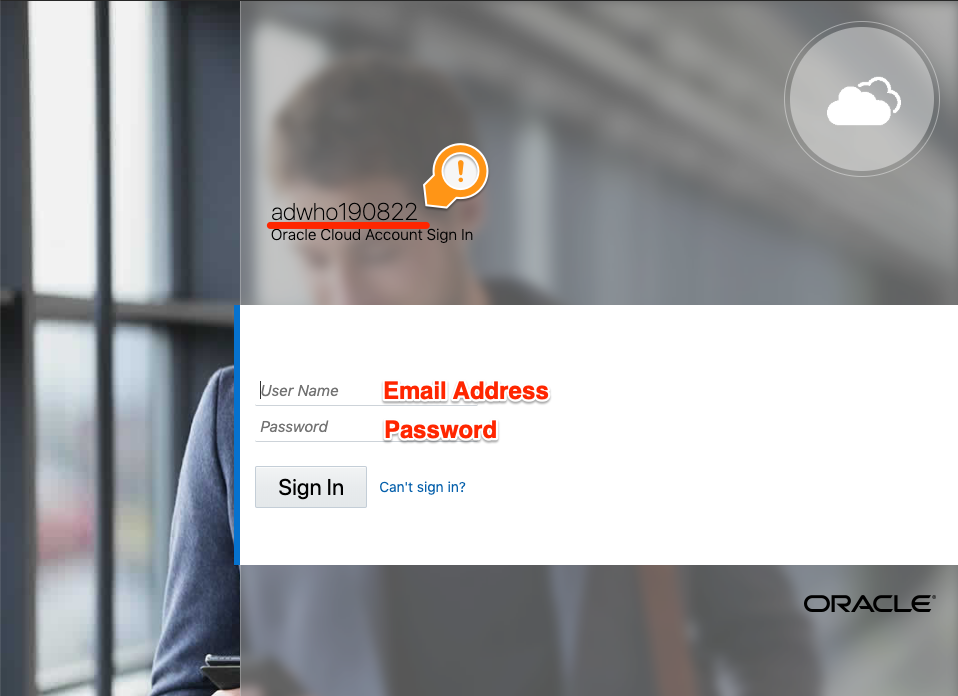

# 05 Analytics : 이제 분석을 해볼까요?

## 실습 소개

앞에서는 자율 운영 데이터 웨어하우스를 생성도 하고 모니터링과 쿼리 날리는 방법도 익혔습니다.
이제 본격적으로 데이터를 분석하는 방법을 알아봅니다.
쉽게 접근할 수 있도록 준비하였습니다.

## 실습 목표

- Oracle Autonomous Data Warehouse와 Oracle Analytics Cloud를 통해 데이터를 분석 하기

## 사전 준비 사항

- 웹 브라우저
  - Microsoft Internet Explorer 11+
  - Google Chrome 63+
  - Mozilla Firefox 52+
  - Apple Safari 10+
- 오라클 클라우드 어카운트 (Oracle Cloud Account)
  - 오라클 클라우드 어카운트는 본 세션에 신청하신 이메일로 안내 메일이 전송 되었습니다.
    - **Welcome to ~~** 라는 제목으로 no-reply@oracle.com에서 안내 메일이 발송되었습니다.
  - 오라클 클라우드 어카운트는 오라클 클라우드의 IaaS, PaaS 등 솔루션을 생성하고, 운영하는 공간을 의미합니다.

# Steps

**Note:** 본 가이드에서 제시하는 화면과 실습하시는 분의 계정 상세정보가 다를 수 있습니다. (예: Compartment Name) 

### **STEP 1:  Oracle Cloud 접속**

- 브라우저에서 **[cloud.oracle.com](https://cloud.oracle.com)**로 이동하여 `Sign In`  아이콘을 클릭합니다.
  

  

- `Cloud Account Name `을 입력하고, `Next` 클릭합니다.
  

  

- 계정 정보를 입력 후,    `Sign In` 클릭합니다.

  

- Hello World! 오라클 클라우드에 오신 것을 환영합니다!

  

[첫 페이지로 돌아가기](./README.md)

[이전 핸즈온으로 돌아가기](04-query-adw.md)

[다음 핸즈온으로 넘어가기](06-machine-learning.md)