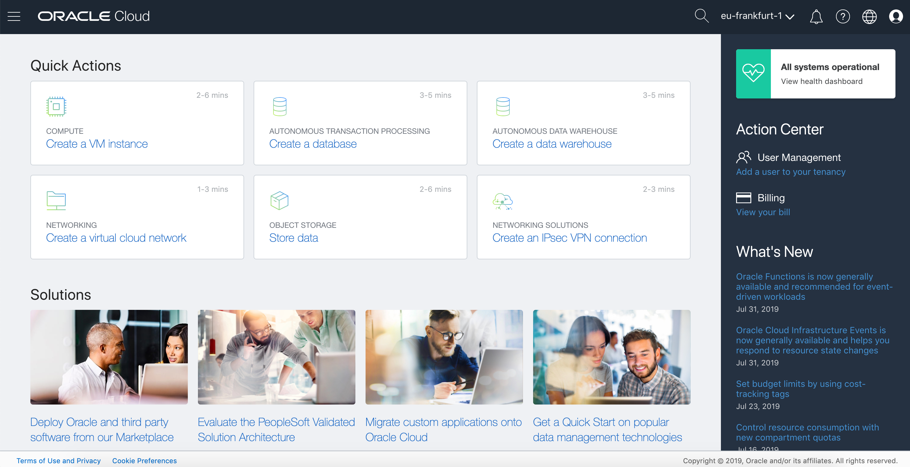
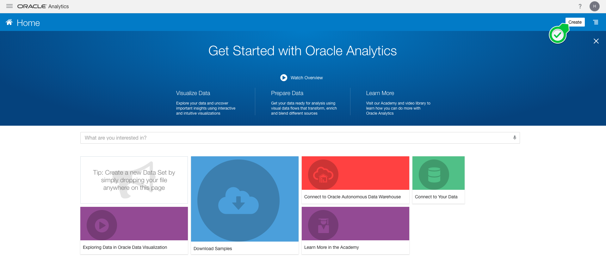
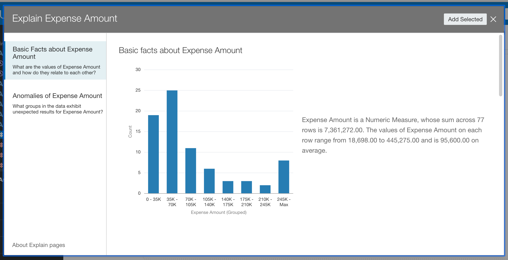
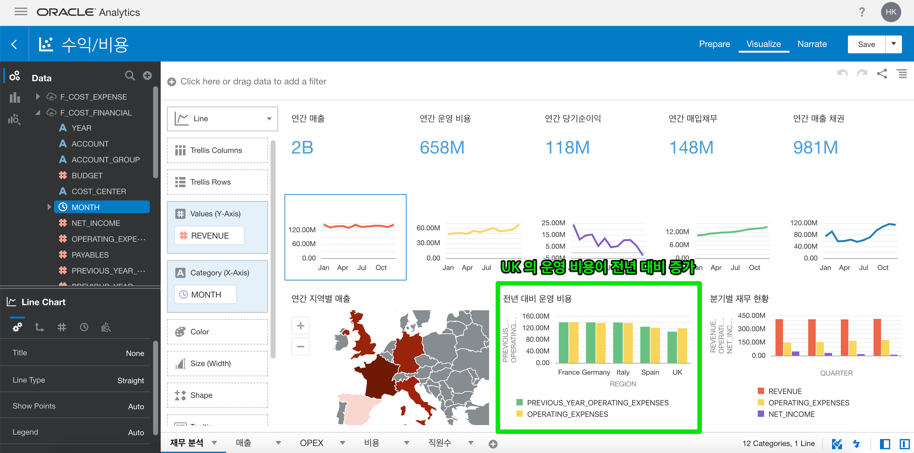
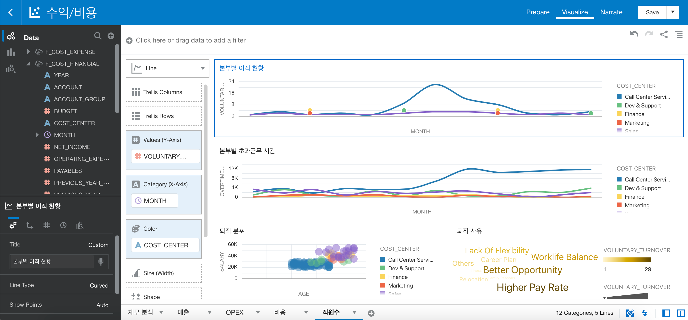
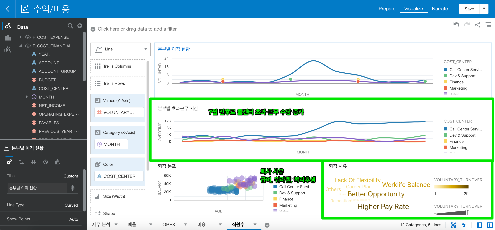

# 05 Analytics : 이제 분석을 해볼까요?

## 실습 소개

앞에서는 자율 운영 데이터 웨어하우스를 생성도 하고 모니터링과 쿼리 날리는 방법도 익혔습니다.
이제 본격적으로 데이터를 분석하는 방법을 알아봅니다.
쉽게 접근할 수 있도록 준비하였습니다.

## 실습 목표

- Oracle Autonomous Data Warehouse와 Oracle Analytics Cloud를 통해 데이터를 분석 하기
- Cloud Wallet 만들어 보고 사용하기
  - Cloud Wallet은 자율 운영 데이터 웨어하우스를 사용하기 위해서 사용자 자격 증명 서비스입니다.

## 사전 준비 사항

- [Sample Data Excel File](./file/finance_manager.xlsx)
- 오라클 분석 클라우드 (Oracle Analytics Cloud)
- 자율 운영 데이터 웨어하우스 (Oracle Autonomous Data Warehouse)
- ~~데이터베이스 지식~~
  - 아주 아주 간단한 Query Syntax (SELECT / FROM만 알아도 괜찮아요)
- 웹 브라우저
  - Microsoft Internet Explorer 11+
  - Google Chrome 63+
  - Mozilla Firefox 52+
  - Apple Safari 10+
- 오라클 클라우드 어카운트 (Oracle Cloud Account)

# Steps

### **STEP 1:  ADW Cloud Wallet 생성**

- 생성한 adwoac0의 Oracle Autonomous Database 화면으로 접속 후, `DB Connection`을 선택합니다.
  

  

- `Download `를 선택합니다.
  

  

- 패스워드를 입력 후, `Download`를 선택합니다. zip 형태의 Cloud Wallet 파일이 다운로드 됩니다.

  Password: Oracle987654
  
  

### **STEP 2:  Oracle Analytics Cloud 생성**

- Oracle Cloud Dashboard Console로 돌아옵니다.
  

https://console.eu-frankfurt-1.oraclecloud.com/

  

- 좌측 상단의 햄버거 메뉴를 선택합니다.

  

  

- My Services Dashobard를 선택합니다.

  

  

- Cloud My Services Dashboard 입니다.

  

  

- 좌측 상단의 햄버거 메뉴를 선택합니다.

  

  

- Analytics를 선택합니다.

  

  

- Analytics Cloud 관리창입니다.

  

  

- Create Instance를 선택합니다.

  

  

- Instance Name만 입력하고, 나머지는 기본값으로 둔 채 Next를 선택합니다.

  Instance Name: adwoac0~n

  

  

- 생성할 정보를 다시 한 번 확인하고, Create를 선택합니다.

  

- Status가 Creating service 상태인 것을 확인 할 수 있습니다.

  Status가 사라지면 생성 완료 상태입니다.

  

- Oracle Analytics Cloud 서비스를 이용해보도록 하겠습니다.

  먼저 생성된 adwoac0의 우측의 메뉴 아이콘을 선택합니다.

  

  

- Oracle Analytics Cloud URL을 선택합니다.

  

  

- 환영합니다! Oracle Analytics Cloud 입니다.

  

  

### **STEP 3:  Oracle Analytics Cloud로 쉽게 대시보드 만들기**

- Oracle Analytics Cloud 서비스 화면에서 `Create`  아이콘을 선택합니다.
  

- `Data Set (데이터셋)` 을 선택합니다.
  

- 파일을 업로드 하기 위하여 `Drop data file here or click to browse`  아이콘을 선택합니다.
  

- 미리 다운로드 했던 `finance_manager.xlsx` 를 선택합니다.
  

- EXCEL 파일을 Oracle Analytics Cloud에 저장하고자 합니다. Name 수정하고, 파일의 데이터를  살펴 보고 `Add` 를 선택합니다.

  Name: finance_manager-이름 이니셜 

  

- 파일의 데이터를 클라우드(Oracle Analytics Cloud)에 저장하였습니다.

  

- 아주 간단한 데이터 전처리를 해볼까요?

  `요일`을 뽑아봅시다. 어떻게 할까요?
  쉽습니다! Oracle Analytics Cloud는 자동으로 추천해줍니다. 추천 리스트 중에  `Extract Day of Week from Month` 를 선택합니다.
  Python에서 같은 작업을 할 때는 DataFrame 라이브러리를 사용하여 조금은 코드를 구성해야 하는데, 여기서는 간단한 몇 번의 클릭으로 처리가 가능하죠.

  

  

- 요일 컬럼의 이름을 변경해볼까요.

  컬럼에 마우스를 가까이 간 후에 메뉴 버튼을 선택합니다. 그리고 Rename을 선택합니다.

  

- Name에 Day of Week 또는 요일을 입력하고 Add Step을 선택합니다.

  

  

- 컬럼명이 바뀌었는지 확인 후, 본격적으로 간단한 데이터 분석을 해보겠습니다.
  Create Project를 선택합니다.

  

- 첫 프로젝트입니다. 새 하얀 대시 Canvas를 어떻게 채울까요?
  조금은 막막할 수 있을 것 같아요. 걱정 하지 마세요. 어렵지 않게 추가해보는 방법을 알아 보도록 할게요!
  Oracle Analytics Cloud는 데이터를 살펴 보고 연관성 있는 데이터를 그래프로 제시해줍니다!

  

  

- 왼쪽에 입력한 데이터 컬럼명들이 보입니다.
  Expense Amount 컬럼에서 마우스 우클릭을 합니다.

  Explain Expense Amount를 선택합니다.

  

  

- 데이터를 살펴보고 제시해주는 그래프를 선택해보도록 합니다.

  그래프에 마우스 커서를 올리면 체크 박스가 나타납니다. 체크해봅니다.
  왼쪽에 Basic Facts about Expense Amount와 Anomalies of Expense Amount에 여러 그래프를 살펴 보아요.
  그리고 자유롭게 원하시는 그래프를 선택한 후에 Add Selected를 선택합니다.

  

  

  

  

- 아주 간단하게 대시보드가 구성되었습니다!

  

  

- 하단의 + 버튼을 눌러서 캔버스를 새로 만듭니다.

  

  

- 좌측의 데이터 컬럼 중에서 SubCategory와 Expense Amount를 선택합니다.
  여러 컬럼을 선택하는 것은 Ctrl(Command)을 누른 채 마우스를 왼쪽 버튼을 누릅니다.

  

- 선택된 컬럼을 우측에 Drop Visualization or Data Here 로 드래그 앤 드롭으로 내려줍니다.

  

- Expense Amount by SubCategory 차트가 하나 생겼습니다.
  서브 카테고리 별로 지출 금액을 알 수 있습니다.

  

- Day of Week과 Budget을 선택하여 동일하게 선택합니다.

  

- 동일하게 드래그 앤 드롭을 합니다. 누른 채 이동해서 Expense Amount by SubCategory 왼쪽으로 이동하면, 파란색 블럭 바가 생성됩니다. 그 상태에서 마우스를 버튼을 놓아줍니다.

  

- Budget by Day of Week이 생성되었습니다. 요일 별로 Budget이 생성되었습니다.

  

### **STEP 4:  Oracle Analytics Cloud 대시보드 분석하기**

- 이번에는 이미 구성된 대시보드를 살펴볼 거에요.

  현재 화면에서 상단 좌측의 햄버거 메뉴를 선택 후, `Projects`를 선택합니다.

  

- `Shared Folders > 재무 관리 > 수익/비용 `을 선택합니다.

  

  

  

  

- `캔버스 `는 여러 차트를 생성하여 목적에 따라 구별하여 생성할 수 있습니다.
  그리고 생성된 캔버스는 하단에 캔버스 탭에서 생성 및 이동이 가능합니다.

  

  

- `데이터 분석`을 시작해보아요.

  연간 매입, 매출이 증가하고 있지만 당기순이익은 하락하고 있습니다.

  

- 아마도 영국의 운영 비용이 전년 대비 증가해서 일까요?

  

  

- 매출 캔버스로 이동해보았습니다.

  

  

- 상품 카테고리 별 매출이 보이네요.

  

  

- 상품 카테고리 별 매출이 보이네요.

  프린터가 제일 잘 나가네요.

  

  

- OPEX 캔버스로 이동합니다.

  

  

- 3, 4 분기 당기순이익이 감소하고 있습니다.

  

  

- 4분기 운영 비용이 증가하였습니다.

  

  

- 국가별로 데이터를 보고 싶어졌어요.
  상단에 REGION을 선택하여 아무 국가를  선택 후 변경된 대시보드를 볼 수 있습니다.
  저는 UK 영국을 선택했습니다.

  

  

  

  

- 비용 캔버스로 이동하였습니다.

  

- 8월부터 목표 대비 실적이 감소하고 있습니다.
  이 말 뜻은 목표 대비 비용이 증가하고 있다는 뜻이지요. 왜 일까요?

  

  

- 8월부터 출장비가 증가하고 있습니다.

  호텔 비용이 지나치게 늘어났습니다.

  

  

  

- 그리고 8월부터 전년 대비 인건비가 증가했습니다.

  

- 기본급은 감소했어요. 고용 변동이 있었나봐요?
  그런데 초과 근무 수당은 증가하였습니다.

  

  

- 직원수 캔버스로 이동하였습니다.

  

- 7월 전후로 콜센터에서 이직자가 늘었습니다.

  

- 7월 전후로 콜센터 초과 근무 수당이 늘어났네요. 야근이 엄청나게 증가하였네요.
  퇴사 사유를 살펴 보니 급여, 워라벨, 복리후생 등을 중요하게 생각하고 있어요.

  

  

[첫 페이지로 돌아가기](./README.md)

[이전 핸즈온으로 돌아가기](04-query-adw.md)

[다음 핸즈온으로 넘어가기](06-machine-learning.md)