# 06 Machine Learning :  머신러닝 맛을 봅시다.

## 실습 소개

이번 실습은 오라클 데이터 웨어하우스에서 머신러닝을 통해 데이터를 학습시키고 예측해보는 과정을 진행합니다.

## 실습 목표

- Oracle Autonomous Data Warehouse에서 Machine Learning 알고리즘을 통해 데이터 처리하기t

## 사전 준비 사항

- [Classification Prediction Model 노트북](./file/Classification_Prediction_Model.json)

- 자율 운영 데이터 웨어하우스 (Oracle Autonomous Data Warehouse)

  - [Oracle Machine Learning Tutorials](https://docs.oracle.com/en/cloud/paas/autonomous-data-warehouse-cloud/tutorials.html)
  - [Using Oracle Machine Learning](https://docs.oracle.com/en/cloud/paas/autonomous-data-warehouse-cloud/omlug/using-oracle-machine-learning.pdf)

- 머신러닝 지식

  

  출처 및 소개 : [vas3k blog Machine Learning](https://vas3k.com/blog/machine_learning/?ref=hn)

- ~~데이터베이스 지식~~

  - 아주 아주 간단한 Query Syntax (SELECT / FROM만 알아도 괜찮아요)

- 웹 브라우저

  - Microsoft Internet Explorer 11+
  - Google Chrome 63+
  - Mozilla Firefox 52+
  - Apple Safari 10+

- 오라클 클라우드 어카운트 (Oracle Cloud Account)

# Steps

### **STEP 1:  Oracle Machine Learning User 생성**

- 브라우저에서 **[Oracle Cloud 대시보드]([https://console.eu-frankfurt-1.oraclecloud.com](https://console.eu-frankfurt-1.oraclecloud.com/))**로 이동하여 `Oracle Autonomous Data Warehouse`  메뉴를 클릭합니다.
  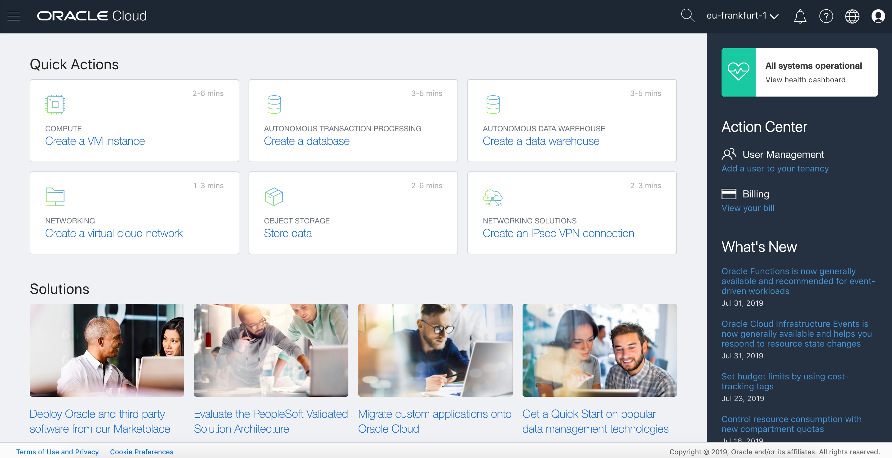

  
  
  
  
- 이번에는 제가 미리 준비한 자율 운영 데이터 웨어하우스를 선택합니다.
  **adwoac1** 을 선택합니다.

  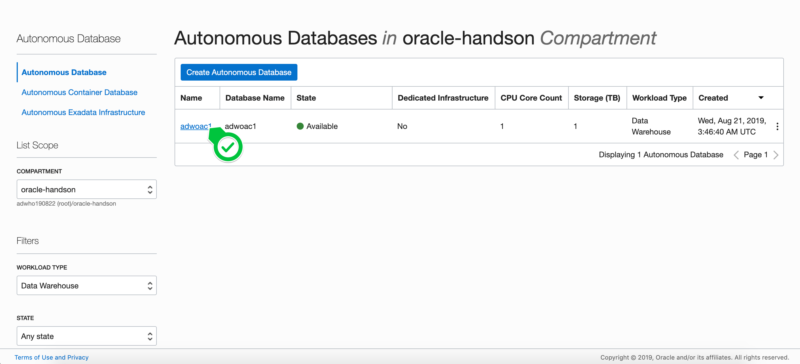

-  `Service Console` 을 선택합니다.
  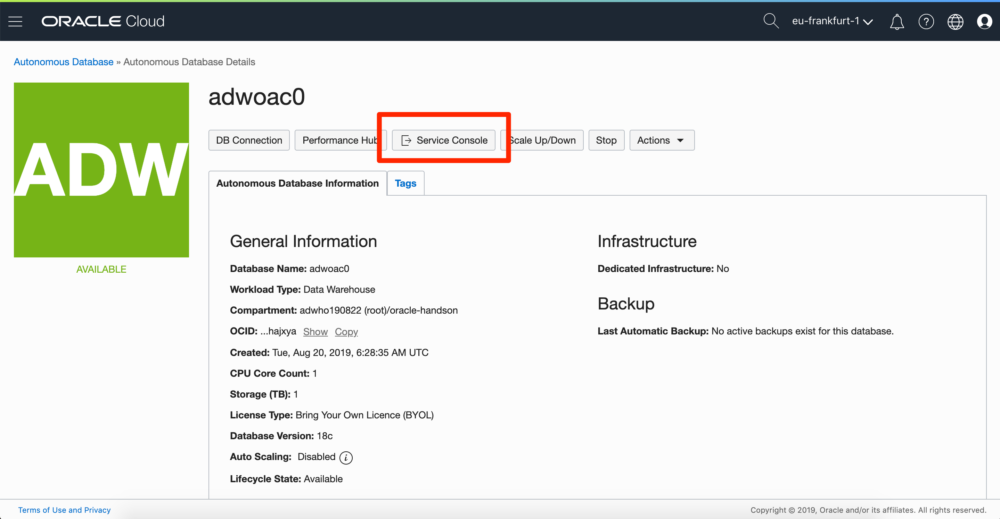

  

- Oracle ML(Machine Learning)을 사용하기 위해서 사용자를 만들어야 합니다.

   `Administration > Manage Oracle ML Users` 를 선택합니다.
  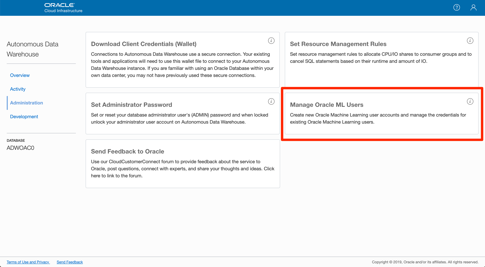

-  `Create` 를 선택합니다.
  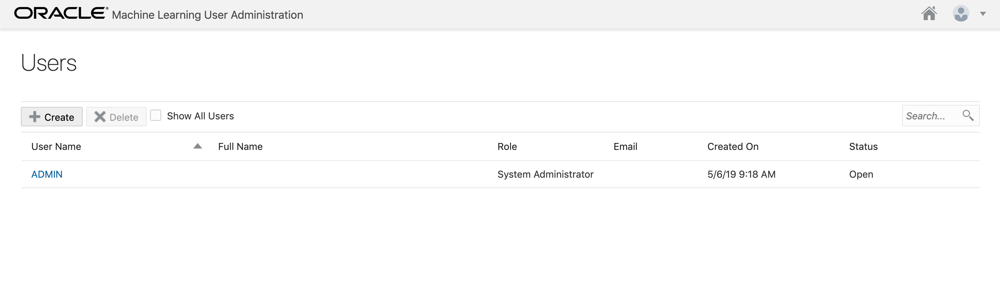

  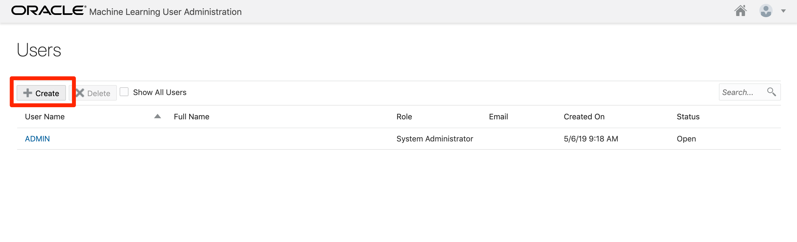

- 입력 폼에 맞춰 계정 정보를 입력하고 `Create` 를 선택합니다.

  Username : omluser01

  Email Address: 오라클 클라우드 어카운트에서 사용 중인 User Email

  Password, Confirm Password

  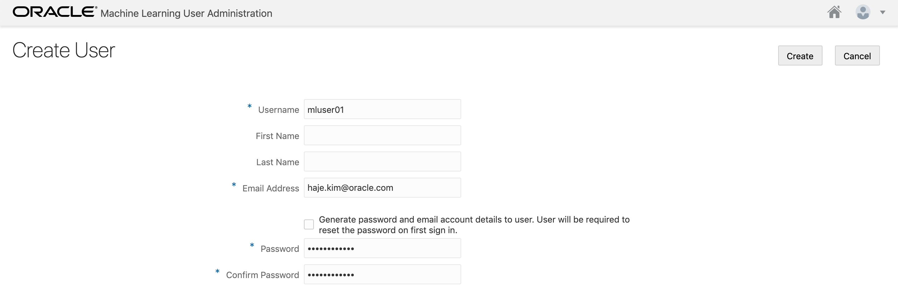

  

- 생성된 유저를 확인하였습니다.

  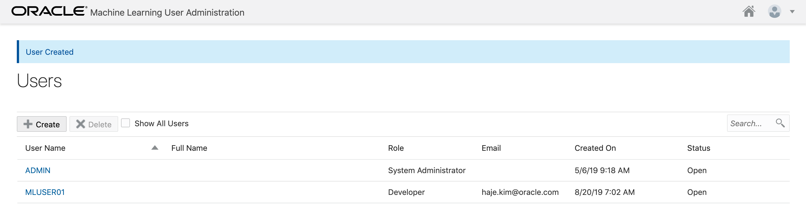

  

- Oracle Autonomous Data Warehouse Dashboard에서 `Development > Oracle ML SQL Notebooks` 를 선택합니다.

  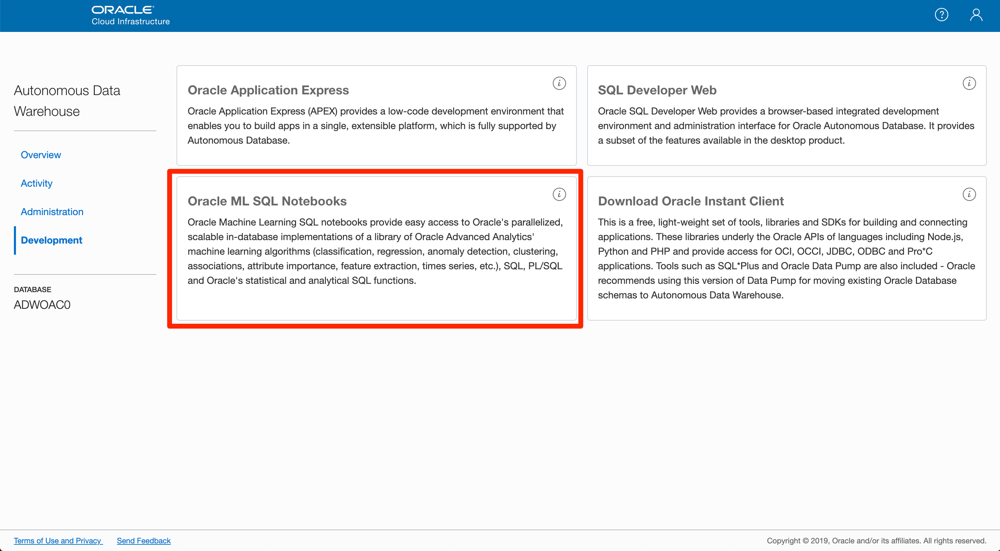

  

- 앞서 생성한 `Username` 과 `Password` 를 입력합니다.

  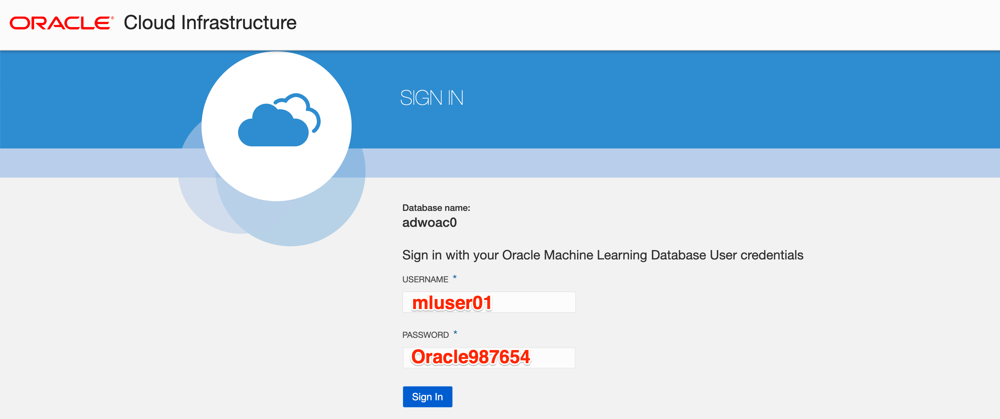

  

- 로그인 후에 Oracle ML 대시보드입니다.

  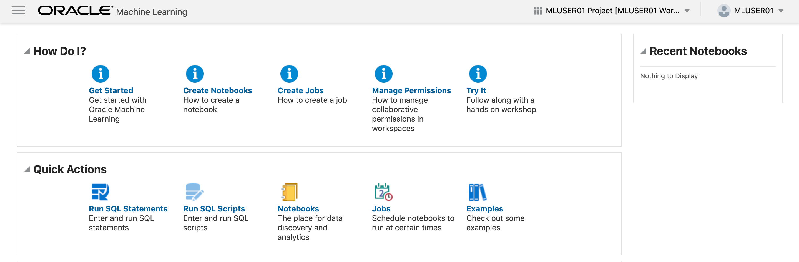

  

- 먼저 `Notebooks` 를 선택합니다.

  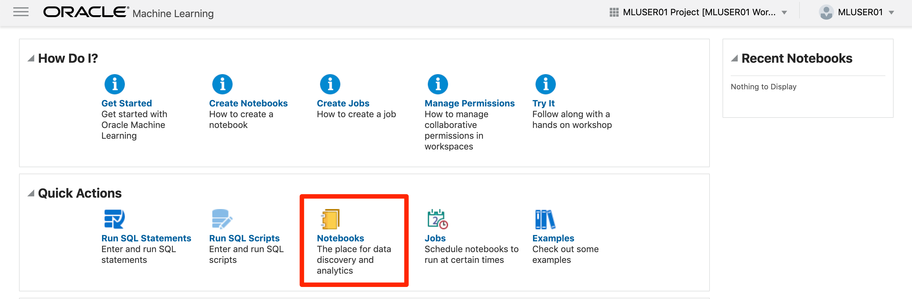

  

- 먼저 `Notebooks` 를 선택합니다.

  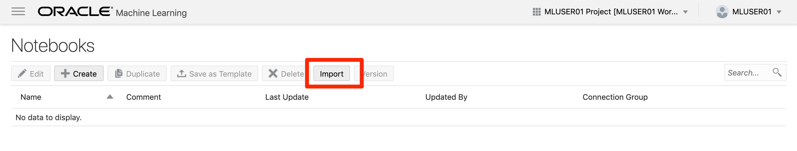

  

[첫 페이지로 돌아가기](./README.md)

[이전 핸즈온으로 돌아가기](05-analytics.md)